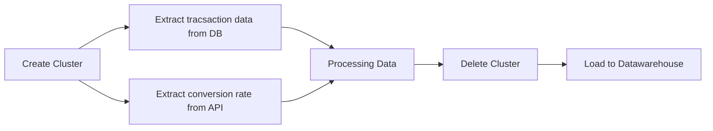

#  Bookdata-ProcessingPipeline
### Table of content 
- [**Description**](#description)
- [**Pipeline Diagram**](#pipeline-diagram)
- [**Tech Stack**](#tech-stack)
- [**Requirement**](#requirement)
- [**Environment Setup**](#environment-setup)
- [**How to use**](#how-to-use)
- [**Credits**](#credits)

## Description
This project was inspired by dataTH's data pipeline workshop. This workshop was about to extract bookstore data and construct a ETL pipeline to processing transaction data of customer who buy a book from bookstore to creating a dashboard for business team to figured out which book product that have more impact in bookstore. In the dataTH's workshop they use airflow on the **Google Cloud Platform** to provide a airflow that schedule a ETL process and create a dashboard with **Looker Studio** from data that stored in Datawarehouse (e.g. **BigQuery**). However I realized that they had do whole stuff of a ETL process in airflow which makes a long compute time when facing with a large data.  Therefore I decide to using **Dataproc** for *Extract* and *Process* data from that will optimize  compute time of pipeline.

## Pipeline Diagram

## Tech Stack
	 - Apache Airflow (ETL scheduler)
	 - Pyspark package (Processing large data with python)
	 - Dataproc (Processing tool)
	 - BigQuery (Datawarehouse)
	 - Looker Studio (Building dashboard)
**Note :** This project had made on the *Google Cloud Platform* it maybe have a different step when do on a local machine that will not discuss in this project.

## Requirement
- having a GCP account to access all of the resource for using in this project
- enable all of the following service *Cloud Composer* , *Dataproc* , *BigQuery*

## Environment Setup
1. ### Setup Composer
 - Navigate to **Cloud composer** and click on create button.
 - Add a configuration to airflow (e.g. airflow name , storage disk size etc.)
 - Create a **Cloud composer** in any of version with airflow 2.0 (20-30 min to complete)

2. ### Setup Dataproc Bucket
	 during your **cloud composer** creating process you still have time to create a **bucket** for storing source code for *Extract* and *Processing* data.

- Navigate to **Cloud storage** and click a create button.
- Add a configuration to bucket (e.g. region , storage class etc.)
- After a bucket is created upload file for ETL process (e.g. extractDB.ipynb , extractAPI.ipynb , processing.ipynb)
	
3. ### Setup DAG 
	 After airflow had created navigate to DAG folder and upload **airflowDAG.py** into DAG folder using **google cloud storage** command (e.g. gsutil)
		 
		 gsutil cp airflowDAG.py gs://your/path/dags/
	 Or you can upload to UI of **Cloud storage** by navigate to **Cloud storage** and find dag folder of **airflow bucket** then click upload button and just upload file to dag folder

## How to use
 After accomplish the setup step then everything is ready to starting **ETL** process. 

- Nevigate to **Cloud composer** and click into composer that running 
- Click on **Open Airflow UI**
- Click on **DAG** that you just upload to **DAG folder** 
- Click on play button that locate on your top-left screen

After **DAG** complete every tasks data that passing through **ETL** process will appear at **BigQuery** and ready to be analytic you can do a dashboard from data in **BigQuery**. I upload my dashboard that create from **Looker Studio** in this git repository. You can checked out my dashboard in this repository.

## Credits
1. [DataTH school](https://school.datath.com/) for inspired this project
2.  [Sushil Kumar](https://www.youtube.com/@kaysush) for demonstration using **airflow** with **dataproc operation**
